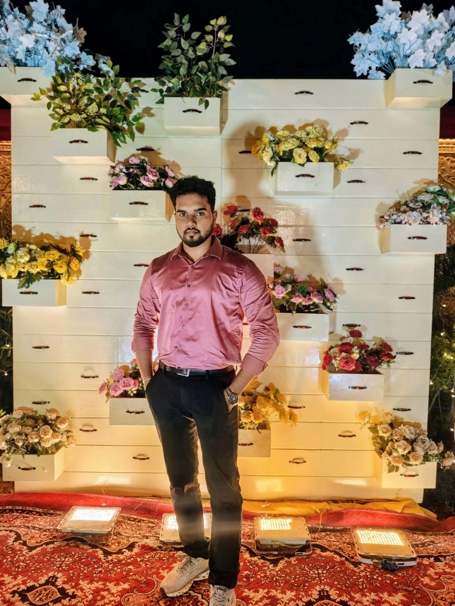

# Aditya Raj - Java Portfolio Application & AI Chatbot

A state-of-the-art personal portfolio application built in **modern Java (JDK 26)** featuring an ultra-sleek glassmorphic web interface and an intelligent AI chatbot trained on Aditya Raj's complete professional resume, enterprise experience, cloud achievements, and social channels.



---

## 🌟 Highlights & Features

1. **Modern Glassmorphic Web UI**:
   - **Hero Section**: Showcases Aditya's portrait (`me.png`), glowing ambient background, dynamic typewriter role title, and immediate CTAs.
   - **Metrics Ribbon**: 2+ Years Exp, 60x Pipeline Acceleration, 7+ Enterprise Apps, 99%+ Uptime, 500+ LeetCode/GFG Problems Solved, 200+ Production Incidents Resolved.
   - **About Me**: Narrative on enterprise systems engineering, cloud architectures, and governance.
   - **Work Experience**: Interactive timeline detailing roles at **Capgemini** (*Senior Software Engineer & Software Engineer for Client: APTIV / Versigent*) and **Celebal Technology** (*Node.js Developer Intern*).
   - **Technical Skills Matrix**: Filterable grid (Backend & Java, Cloud & Low-Code, Databases, Frontend & Tools) with proficiency ratings.
   - **Projects Showcase**: Electricity Billing System (Java, Swing, MongoDB), Employee Management Website (Node.js, Express, MongoDB), and Cloud Pipeline Automator (GCP Cloud Composer, Airflow).
   - **Certifications & Accreditations**: Capgemini Certified Java Full Stack (React), Microsoft Azure AI Fundamentals (AI-900), Microsoft Azure Fundamentals (AZ-900), AWS Certified Cloud Practitioner, and Capgemini 'Champion' recognition.
   - **Education**: B.Tech in Computer Engineering from Lovely Professional University (LPU), CGPA 7.79 / 10.
   - **Official Resume Viewer**: In-browser preview modal and 1-click PDF download (`Aditya_Raj_Resume.pdf`).
   - **Contact Hub**: Instant copy & launch channels for Email, Phone (+91 9570119979), and LinkedIn.

2. **🤖 Intelligent AI Chatbot ("Aditya AI")**:
   - Built directly into the Java backend (`AdityaKnowledgeBot.java`) with zero external API dependencies.
   - Answers any question about Aditya's work at Capgemini, the 60x Airflow optimization, SharePoint to Microsoft Graph API migration, 200+ incident resolutions, tech stack, certifications, education, and contact links.
   - Provides **actionable interactive buttons** directly inside chat messages (e.g., *[Download Resume]*, *[View LinkedIn]*, *[Send Email]*, *[Call Aditya]*).
   - Dynamic suggested follow-up chips for frictionless continuous conversation.
   - Built-in Text-To-Speech (audio toggle) to listen to answers.

3. **Pure Java Core**:
   - Uses JDK 26 embedded `com.sun.net.httpserver.HttpServer` with Virtual Threads (`Executors.newVirtualThreadPerTaskExecutor`).
   - Zero Maven/Gradle bloat, compiles in under 1 second, zero external package vulnerabilities.
   - Includes an optional desktop Swing companion window for controlling the server.

---

## 🚀 How to Run

### Option 1: Double-Click Launcher (macOS)
Simply double-click:
```bash
run.command
```
This will compile the Java code, launch the server on `http://localhost:8080`, and open your browser automatically.

### Option 2: Terminal Execution
```bash
./start.sh
```

### Option 3: Manual Java Compilation & Run
```bash
# Compile
/Library/Java/JavaVirtualMachines/jdk-26.jdk/Contents/Home/bin/javac -d bin src/main/java/com/adityaraj/portfolio/*.java

# Run
/Library/Java/JavaVirtualMachines/jdk-26.jdk/Contents/Home/bin/java -cp bin com.adityaraj.portfolio.AdityaPortfolioApp
```
Then visit: **[http://localhost:8080](http://localhost:8080)**

---

## 📁 Project Structure

```
Protfolio/
├── Aditya_Raj_Resume.pdf       # Official resume document
├── me.png                      # Aditya Raj's high-resolution portrait
├── run.command                 # macOS 1-click double-clickable launcher
├── start.sh                    # Linux / macOS shell launcher
├── bin/                        # Compiled Java bytecode
├── src/main/java/com/adityaraj/portfolio/
│   ├── AdityaPortfolioApp.java # Main application launcher & Swing companion
│   ├── AdityaHttpHandler.java  # HTTP routing, static file server & REST APIs
│   └── AdityaKnowledgeBot.java # AI chatbot NLP engine & resume knowledge base
└── web/
    ├── index.html              # Modern responsive portfolio SPA
    ├── css/
    │   └── styles.css          # Glassmorphism dark theme styling
    ├── js/
    │   └── app.js              # Client controller, animations & chatbot interface
    └── assets/                 # Profile images and resume files
```

---

## 📬 Contact & Socials

- **LinkedIn**: [linkedin.com/in/iadityaraj1412](https://www.linkedin.com/in/iadityaraj1412)
- **Email**: [iadityaraj1412@gmail.com](mailto:iadityaraj1412@gmail.com)
- **Phone**: [+91 9570119979](tel:+919570119979)
- **Location**: Bengaluru, Karnataka, India
- **Link**: [https://protfolio-adityaraj.vercel.app] 

